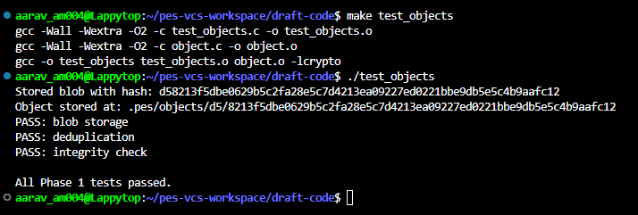
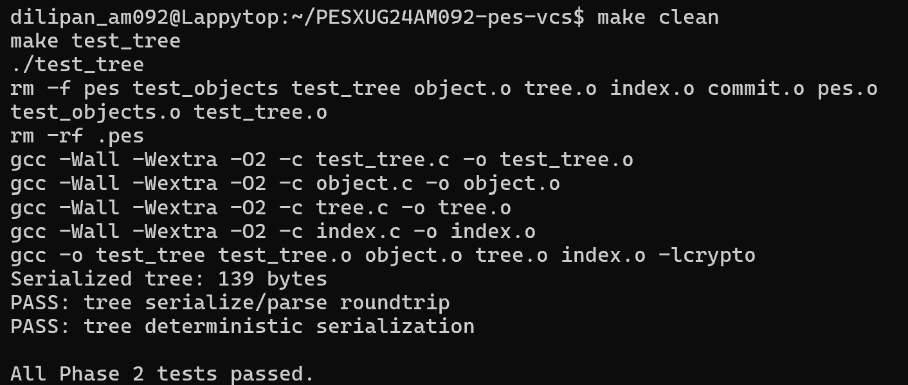
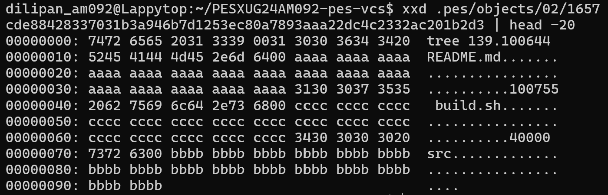
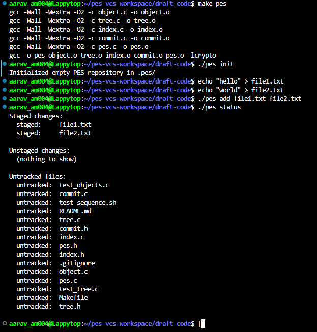
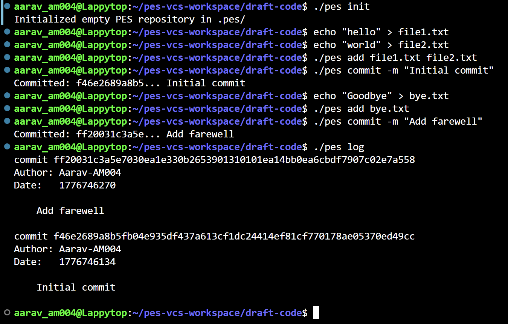
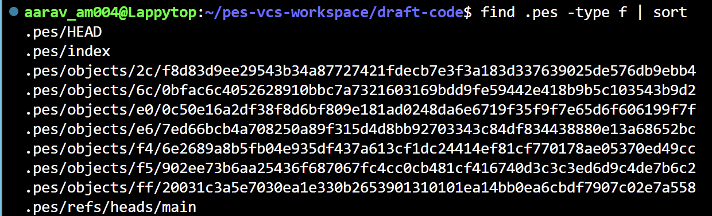
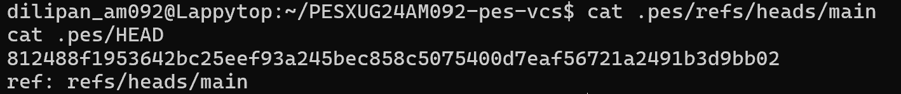

# PES-VCS: Version Control System from Scratch

Hey! This is my implementation of a local, Git-style version control system built from scratch in C for my OS lab. It tracks file changes, manages a staging area, stores snapshots using content-addressable storage (SHA-256), and builds a linked commit history.

---

##  Phase 1: Object Storage Foundation
**Task:** Built the core storage engine. Implemented deduplication and atomic writes (writing to a `.tmp` file and renaming it) so the system doesn't corrupt data if it crashes mid-write. Every file is hashed and sharded into directories based on the first two characters of its hex hash.

**Commands Run:**
\`\`\`bash
make test_objects
./test_objects
find .pes/objects -type f
\`\`\`

**Screenshots:**
*Output showing tests passing and the sharded directory structure:*

---

##  Phase 2: Tree Objects
**Task:** Implemented the logic to turn flat lists of staged files into a recursive directory structure. Wrote a recursive function to group files by their directory prefixes and build tree objects from the bottom up, matching actual Git directory tracking behavior.

**Commands Run:**
\`\`\`bash
make test_tree
./test_tree
xxd <tree-object-path> | head -20
\`\`\`

**Screenshots:**
*Output showing tests passing and the raw binary format of a tree object:*

---

## Phase 3: The Index (Staging Area)
**Task:** Built the `.pes/index` tracking system. When a file is added, it gets hashed, saved as a blob, and added to the index with its metadata (size, modification time). Added sorting to ensure deterministic behavior and atomic saving for the index file itself.

**Commands Run:**
\`\`\`bash
./pes init
echo "hello" > file1.txt
echo "world" > file2.txt
./pes add file1.txt file2.txt
./pes status
cat .pes/index
\`\`\`

**Screenshots:**
*Output showing the add/status sequence and the raw text format of the index:*

---

##  Phase 4: Commits and History
**Task:** Tied everything together. Implemented the commit creation process, which builds a tree from the index, links it to the parent commit, attaches author metadata, serializes it to disk, and moves the `HEAD` pointer forward. 

**Commands Run:**
\`\`\`bash
./pes commit -m "Initial commit"
echo "Goodbye" > bye.txt
./pes add bye.txt
./pes commit -m "Add farewell"
./pes log
find .pes -type f | sort
cat .pes/refs/heads/main
cat .pes/HEAD
make test-integration
\`\`\`

**Screenshots:**
*Output showing the commit log, object store growth, reference chain, and the final integration test:*

---

## 🧠 Phase 5 & 6: Analysis Questions

**Q5.1: Branching and Checkout Implementation**
To implement a `pes checkout <branch>` command, the system needs to read the commit hash from the target branch file and update the `.pes/HEAD` file to point to it. The complex part is updating the working directory safely: the system must recursively traverse the target commit's tree and mirror those files to the working directory while aggressively ensuring it doesn't accidentally overwrite any uncommitted, unsaved work the user currently has open. 

**Q5.2: Detecting a "Dirty" Working Directory**
To figure out if a checkout will cause a conflict without rehashing everything, we do a quick three-way check. First, we compare the current branch's tree with the target branch's tree to see if the file actually differs. Then, we look at the `.pes/index` file; if a file's metadata in the index differs from the current branch's baseline, it means the user has modified or staged it. If the file is modified *and* it differs between the two branches, we have a dirty conflict and must refuse the checkout to protect the user's work.

**Q5.3: Detached HEAD State**
If you commit while in a detached HEAD state, the commit object successfully saves to the object store, and `HEAD` updates to point directly at that new hash. However, because no branch pointer (like `main`) is updated, the moment you switch to another branch, those new commits become "orphaned" and invisible to standard logs. To get them back, a user has to dig up the exact hash of the orphaned commit and manually create a new branch pointer directed right at it.

**Q6.1: Garbage Collection Algorithm**
To clean up a massive repository, a mark-and-sweep algorithm using a Hash Set is the best approach. In the "mark" phase, we start at every branch reference in `.pes/refs/heads/`, walk backwards through all parent commits, and tag every commit, tree, and blob hash we encounter as "reachable" by adding them to the Hash Set (which gives us O(1) lookups). In the "sweep" phase, we just loop through the actual `.pes/objects/` folder and delete any file whose hash isn't in our set. For a repo with 100k commits, we'd have to traverse millions of blobs and subtrees during the mark phase, but the sweep itself would be highly efficient.

**Q6.2: GC Race Conditions**
Running GC in the background while someone is committing is a recipe for disaster due to race conditions. For example, if a user runs `pes add file.txt`, a blob is generated; if GC sweeps right at that millisecond before `pes commit` runs, it will delete the new blob because it isn't linked to a commit tree yet, completely corrupting the upcoming commit. Git solves this by enforcing a grace period—usually two weeks—meaning the GC will only delete unreachable objects if their file timestamps prove they are genuinely old and abandoned, ignoring freshly minted files entirely.